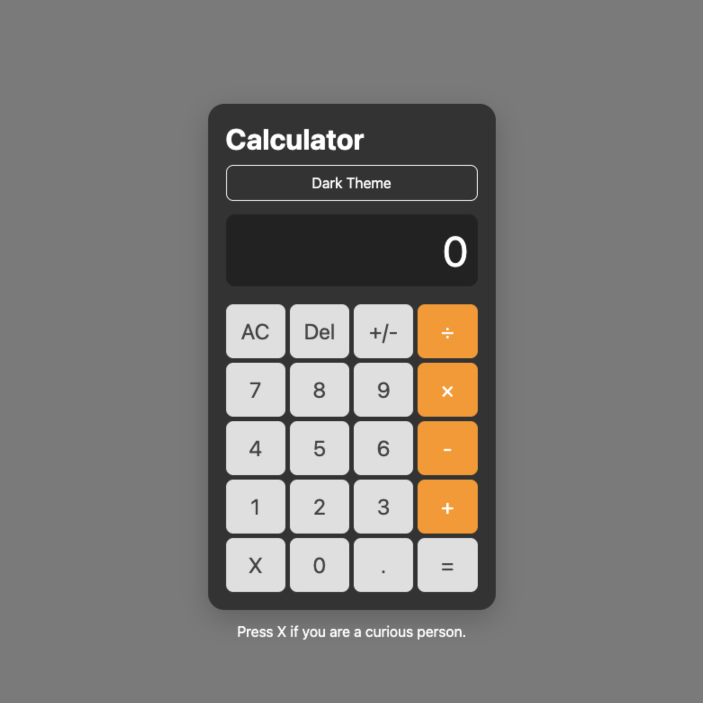

# JS Calculator

## Overview
A fully functional, responsive calculator built from scratch to solidify foundational web development skills. This project focuses on clean architecture, modern JavaScript practices, and accessible UI design without relying on external frameworks.

## Features
* **Standard Arithmetic:** Addition, subtraction, multiplication and division.
* **Keyboard Support:** Full keyboard accessibility for seamless, mouse-free use.
* **Responsive Design:** Fluid layout powered by CSS Grid that adapts to any screen size.
* **Robust Error Handling:** Prevents division by zero and handles edge-case decimal inputs.

## Tech Stack
* **HTML5:** Semantic markup (`<main>`, `aria-labels`) for accessibility.
* **CSS3:** Custom properties (`:root` variables) for scalable theming and CSS Grid for precision layout.
* **Vanilla JavaScript (ES6+):** * Implements **Event Delegation** for highly efficient DOM interaction.
    * Uses an internal `state` object for predictable data management.
    * Avoids "WET" (Write Everything Twice) code in favor of modular, "DRY" functions.

## Technical learnings
The primary goal of this project was to exhibit a full working product with foundational knowledge. Key milestones included:
1. **Event Delegation:** Use a single, centralized listener on the parent container, routing clicks based on target classes.
2. **State Management:** Encapsulating mathematical variables into a distinct object to prevent global scope pollution.
3. **Accessibility (a11y):** Use readonly inputs and adding `aria` attributes to ensure screen reader compatibility.

## How to Run Locally
1. Clone the repository: `git clone https://github.com/dado-6/calculator.git`
2. Navigate to the directory: `cd calculator`
3. Open `index.html` in your preferred web browser.